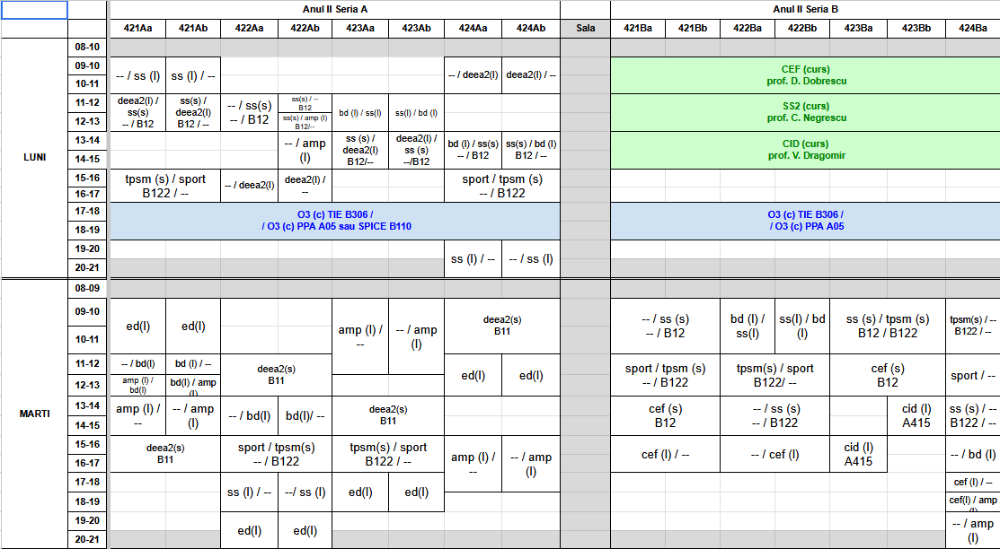
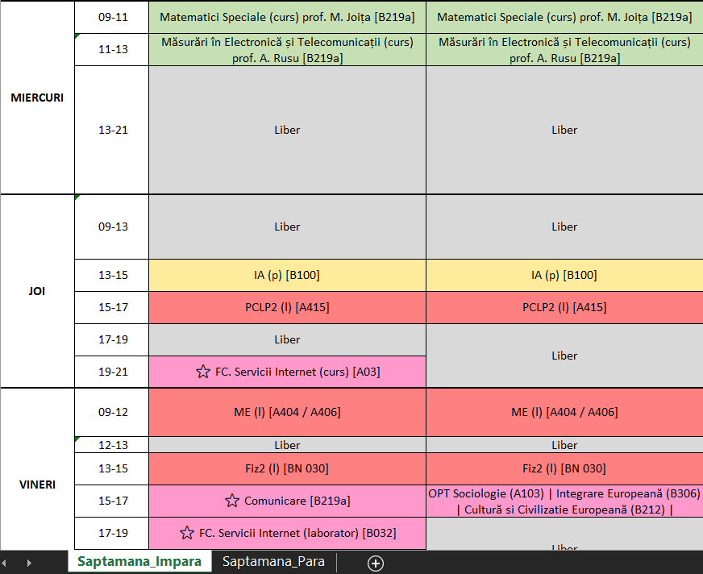

# ETTI Timetable Generator

A Python tool that parses the official ETTI UPB Excel timetable and generates a personalized, color-coded Excel schedule for a specific group and subgroup.

## Overview

The official ETTI UPB timetable can be difficult to read because it contains dense information, merged cells, separate room sheets, odd/even week structures, and optional subjects that vary from one student to another.

This project automates the process of cleaning the official Excel file, extracting the relevant schedule for a selected group, matching room information, and generating a personalized Excel timetable.

## Features

- Parses merged cells from the official timetable
- Extracts timetable data for a selected group and subgroup
- Handles odd and even week schedules
- Matches abbreviated subjects with full room information
- Supports optional and elective subjects
- Generates a clean, color-coded Excel output

## Tech Stack

- Python
- pandas
- openpyxl
- re
- collections.Counter

## Project Structure

- `parser_orar.py` - preprocesses the official Excel file and expands merged cells
- `extrage_orar.py` - main script that extracts timetable data and generates the personalized output
- `Generator Orar ETTI.docx` - Romanian project documentation
- `requirements.txt` - project dependencies

## How to Run

### 1. Install dependencies

```bash
pip install -r requirements.txt
```

### 2. Add the official timetable file

Place the official timetable Excel file in the project folder and name it:

```text
orar_etti.xlsx
```

### 3. Run the parser script

```bash
python parser_orar.py
```

This generates:

```text
orar_curatat.xlsx
```

### 4. Run the main script

```bash
python extrage_orar.py
```

### 5. Enter your data

The program will ask for:
- your group
- your subgroup, if applicable
- your optional/elective subject choices

### 6. Get the output

The final file will be generated automatically as:

```text
Orar_Personalizat_[Grupa].xlsx
```

## Example Output

Official timetable fragment:



Generated personalized timetable:



## Limitations

- The project depends on the current structure of the official ETTI timetable file
- Missing or inconsistent information in the source sheets may affect the final output
- The application is tailored specifically for ETTI UPB

## Future Improvements

- graphical user interface
- PDF export
- configurable input and output filenames
- support for other semesters
- support for other faculties
